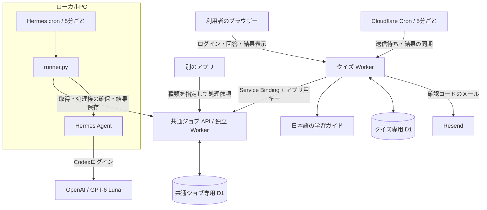
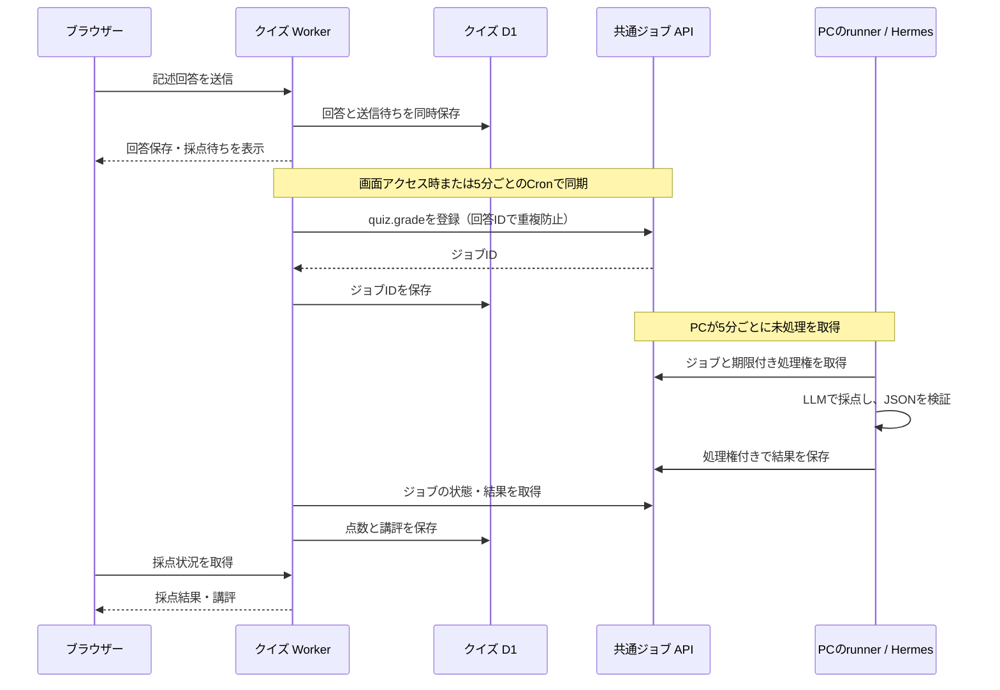

# AI Design Compass — AIシステム設計の学習サイト

AIシステム設計の知識を、クイズと記述回答で確認する日本語の学習サイトです。単に正答率を出すだけでなく、少ない問題から理解があいまいな分野を絞り込み、解説と講評で復習につなげることを目指しています。

WebアプリはCloudflare Workers上で動き、記述回答の採点は独立した共通ジョブAPIを介してPC上のHermes Agentへ依頼します。このリポジトリには学習教材、クイズアプリ、クイズ用DBの定義を収めています。

- **学習サイト**: https://ai-design-compass.kazumasa.workers.dev/
- **学習教材**: [AI_SYSTEM_DESIGN_DOC.md](AI_SYSTEM_DESIGN_DOC.md) ／ [ブラウザーで読む](https://ai-design-compass.kazumasa.workers.dev/guide.html)
- **開発・配置・運用手順**: [クイズアプリのREADME](ai-design-quiz/README.md)
- **共通ジョブAPIとPC側の実行プログラム**: [hermes-llm-jobs](https://github.com/kzmszk/hermes-llm-jobs)（別リポジトリ）

## 何ができるか

- メールに届く確認コードでログインし、回答・診断履歴を利用者ごとに保存します。
- 推論、配信、キャッシュ、RAG、エージェント、連携・音声、安全、評価・運用の8分野を扱います。
- 基礎・応用・設計の3段階、または自動難度調整を選べます。カテゴリは複数選択できます。
- 最初は機械的に正誤判定できる選択問題で確認し、その後に記述問題を含む絞り込みを行います。
- 過去に正解した選択問題と満点の記述問題を、次回の診断では除外します。
- 終了時に問題、自分の回答、正解・解答例、誤答理由、記述回答への講評を表示します。

問題集は計72問（選択48問・記述24問）。通常は12〜16問ですが、カテゴリの限定や正解済み問題の除外により、少ない問題で終了することもあります。未採点の記述回答は誤答に数えません。

出題は分野ごとの仮の能力分布を更新し、追加で得られる情報が多い問題や弱点候補を優先する仕組みです。実受験データによる校正前の学習用診断であり、資格試験のような標準化された能力測定ではありません。

## 全体のアーキテクチャ



### 3つの役割に分ける

| 部分 | 責任 | 保存するデータ |
|---|---|---|
| クイズアプリ（このリポジトリ） | 認証、出題、回答保存、理解度推定、結果表示 | 利用者、回答、診断履歴、点数、講評、送信待ち |
| 共通ジョブサービス | アプリ認証、依頼の受付、処理権、再試行、結果保存 | アプリの許可種類、ジョブ、入力、状態、結果 |
| PCのHermes実行プログラム | ジョブ取得、種類に応じた指示の選択、LLM呼び出し、結果検証 | 接続設定、一時的な結果再送用データ |

クイズと共通サービスは、Worker・D1・GitHubリポジトリをそれぞれ分離しています。共通サービスはクイズのテーブルへ直接書き込まず、クイズ側が結果を取得して自分のDBへ反映します。

**現在PC上で動いているのはHermesとジョブ実行プログラムです。** 採点モデルはCodexログイン経由のGPT-6 Lunaで、推論自体はOpenAI側で行います。PC内だけで推論するローカルモデルは、現在の採点経路では利用していません。

## 回答から採点までのイベント処理

選択問題はクイズWorkerでその場で採点します。時間のかかる記述問題は、次の流れで非同期に扱います。



送信と結果取得は画面アクセス時にも実行するため、同じリクエスト内で登録まで進む場合がありますが、LLMの処理完了を待ち続けることはありません。Cloudflare Queuesを使った構成ではなく、D1のジョブテーブルと定期的な取得で実装しています。

### 工夫1：回答と送信待ちを一緒に保存する

回答を保存してから別途採点依頼を送るだけでは、途中の障害で「回答はあるのに依頼がない」という状態が発生します。そこで、回答と `quiz_job_outbox`（送信待ち）を同じDB更新で保存します。

共通APIに接続できなくても回答は残り、後の同期で再送できます。アプリは保存済み回答を使うため、利用者に同じ回答を入力し直してもらう必要がありません。

### 工夫2：再送しても同じ依頼を増やさない

共通APIへの登録には回答IDを `idempotencyKey` として渡します。同じアプリ・同じキー・同じ内容を再送すると、同じジョブIDが返ります。同じキーで異なる内容を送ると409で拒否します。

たとえば「共通APIでは登録成功したが、クイズ側が応答を受け取れなかった」場合でも、安全に登録を再試行できます。

### 工夫3：期限付きの処理権で実行を調整する

PCのrunnerはジョブ取得時に10分間の処理権を確保し、その証明を添えて結果を保存します。PC内の重複起動はファイルロックで防ぎ、API側も処理権を確認します。

モデル呼び出しは1件150秒まで。失敗は5分後に再試行し、最大3回で失敗とします。通信失敗時の結果はPCに一時保存し、同じ内容を再送します。ただし、停止や処理権の失効をまたぐとモデル呼び出し自体は重複する可能性があり、「必ず一度だけ実行」を保証する仕組みではありません。

### 工夫4：種類ごとに入力・指示・結果を決める

依頼には `type`、`version`、`payload` を持たせます。現在のクイズは `quiz.grade` / `version: 1` を使います。共通サービスは `document.summarize` にも対応しており、別アプリからの要約依頼にも使えます。

Workerで入力形式を検証し、runnerが種類に応じて指示を選び、結果をrunnerとAPIの両側で検証します。入力に任意のコマンドや実行先URLを渡して動かす仕組みではありません。受験者の文章中の命令も採点対象のデータとして扱います。

### 工夫5：アプリと実行者の権限を分ける

共通APIはアプリごとに異なるキーを発行し、依頼可能な種類と結果の取得範囲を制限します。PCのジョブ取得・完了操作は別の実行者用キーで認証します。キーをブラウザーへ渡しません。

PCからAPIへ取りに行くため、PCへの着信接続やTailscale経由の公開は不要です。共通APIのURL自体はインターネットから到達できますが、ジョブ操作には認証が必要です。

## 定期実行と運用上の制約

- **Hermes cron**: 日本時間8:00〜23:59、5分ごと。1回最大2件を処理し、未処理がなければLLMを呼びません。
- **クイズWorkerのCron**: 終日5分ごと。1回最大3件の送信待ち・結果を同期します。LLMを直接呼ぶCronではありません。
- **診断画面**: 採点状況の取得時にもその診断の同期を行います。同じ送信待ちの同期は最低30秒間隔、通信失敗後は60秒後から再試行します。
- **PC停止・夜間・モデルの利用制限**: 回答は保存されますが、採点は次に実行できるまで待ちます。5分以内の完了を保証するものではありません。
- **採点失敗・低いconfidence**: 「採点要確認」として扱い、理解度推定から除外します。confidenceはLLMの自己申告で、校正済みの確率ではありません。

旧Codexアプリの毎時採点は停止済みです。現在の定期処理には、PCとHermesのスケジューラー、モデルの有効な認証・利用枠が必要です。

## ディレクトリ構成

```text
README.md                         このサイトと全体設計の説明
AI_SYSTEM_DESIGN_DOC.md            AIシステム設計の学習教材
LICENSE                           原典のライセンス
ai-design-quiz/
  README.md                       開発・配置・運用の詳細
  public/                         Web UIと生成済み日本語ガイド
  src/                            認証・出題・回答・採点結果の同期
  migrations/                     クイズ用D1スキーマ
  scripts/build-guide.mjs          教材MarkdownからHTMLを生成
  wrangler.jsonc                  本番Worker・DB・Service Binding・Cron
```

学習教材の正本は `AI_SYSTEM_DESIGN_DOC.md` です。ビルド時に `public/guide.html` と `public/AI_SYSTEM_DESIGN_DOC.md` を生成し、アプリ内の復習リンクはガイドの該当節へ移動します。GitHubへのログインは不要です。

## ローカルで起動する

Node.js 22.16以降を用意し、次を実行します。

```sh
cd ai-design-quiz
npm ci
npm run db:local
npm run dev
```

http://127.0.0.1:8787 を開きます。ローカル設定ではメールを送らず開発用コードを表示します。初期設定に共通ジョブサービスの接続は含まれていないため、記述の自動採点には別途開発用サービスとキーの設定が必要です。

本番配置、Resend、Secret、PC側の準備は[運用手順](ai-design-quiz/README.md#本番の配置設定)と[共通サービスのREADME](https://github.com/kzmszk/hermes-llm-jobs)を参照してください。`npm run deploy` は日本語ガイドの生成も行います。

## データとライセンス

クイズDBには利用者のメールアドレス、回答、診断履歴、点数、講評などを保存します。採点の本文として共通サービスとHermesへ送るのは、問題・模範解答・採点基準・回答文です。メールアドレスや利用者IDを本文に加えませんが、回答中に書かれた個人情報は送信対象になります。現在の構成ではOpenAI側で推論するため、回答がPC内だけに留まるわけではありません。

学習教材の原典は Amit Shekhar / Outcome School の [AI System Design](https://github.com/amitshekhariitbhu/ai-system-design)（Apache License 2.0）です。日本語教材とクイズはその内容をもとに再構成しています。ライセンスと著作権表示は [LICENSE](LICENSE)、[公開用NOTICE](ai-design-quiz/public/NOTICE.txt) に保持しています。
