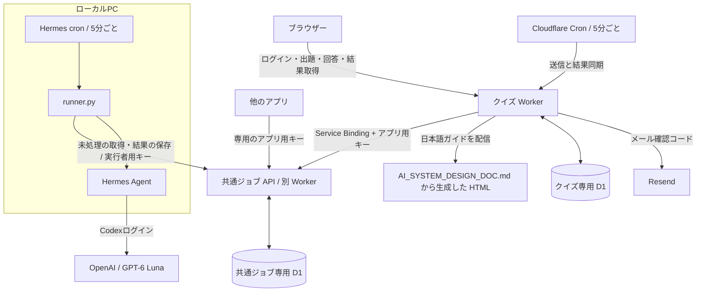

# AI Design Compass

[AIシステム設計の日本語ガイド](../AI_SYSTEM_DESIGN_DOC.md)を題材にした適応型の学習診断です。Cloudflare Workers + D1で動作し、メールの確認コードでログインします。

- 本番: https://ai-design-compass.kazumasa.workers.dev
- アプリ内の日本語ガイド: https://ai-design-compass.kazumasa.workers.dev/guide.html
- 独立した共通ジョブサービス: [hermes-llm-jobs](https://github.com/kzmszk/hermes-llm-jobs)

## 現在のアーキテクチャ

記述回答の採点は、**共通ジョブAPI経由でPC上のHermesに依頼する非同期処理**です。クイズのWorker内でLLMの応答を待ち続けません。

現在、PC上のHermesはCodexログインを利用して `gpt-6-luna` を呼び出します。PCで動くのは定期実行・ジョブ取得・Hermesの処理で、モデルの推論はOpenAI側で行います。PC内で推論するローカルモデルは現在の採点先には設定していません。



### 回答から結果表示まで

1. 選択問題はクイズWorkerが正誤を判定して保存します。
2. 記述回答は、回答と送信待ちデータ `quiz_job_outbox` を同じDB更新で保存します。
3. クイズWorkerが共通APIの `POST /api/jobs` に `quiz.grade` / `version: 1` として依頼します。回答IDを重複防止キーにするため、通信失敗後の再送で同じ依頼を増やしません。
4. PC側のrunnerが未処理ジョブを確保し、Hermesへ問題・模範解答・3つの採点基準・回答を渡します。
5. Hermesが各観点0〜2点、得点の理由、不足や誤り、改善例をJSONで返します。runnerと共通APIが形式を検証し、共通ジョブDBへ保存します。
6. クイズWorkerが `GET /api/jobs/{id}` で結果を取得し、検証後にクイズDBの点数・講評へ反映します。画面はクイズAPIから結果を読みます。

共通サービスはクイズのDBへ直接アクセスしません。完了を通知するWebhookもなく、利用側が結果を取得します。API契約・処理の種類の追加方法は[共通サービスのREADME](https://github.com/kzmszk/hermes-llm-jobs#新しい処理の種類を追加する手順)にあります。

### 定期実行と待ち時間

| 実行場所 | 頻度 | 役割 |
|---|---|---|
| PCのHermes cron | 5分ごと、日本時間8:00〜23:59のみ取得 | 未処理を取得してLLMで採点し、共通APIに保存 |
| クイズWorkerのCron | 5分ごと、終日 | 送信待ちを登録し、完了結果をクイズDBへ同期 |
| 診断画面の読み込み | APIアクセス時 | その診断の送信待ち・採点結果を同期 |
| クイズWorkerの整理処理 | 毎日UTC 03:17（日本時間12:17） | 期限切れログイン情報などを整理 |

PCとHermesのスケジューラーが稼働し、モデルの認証・利用枠が有効である必要があります。Codexアプリの旧毎時採点は停止済みで、現在の定期実行には使いません。PCを外部公開する必要はなく、PCから共通APIへアクセスする方式です。

未処理がなければLLMを呼びません。PC側は1回最大2件、1件150秒まで、処理権は10分です。失敗は5分後に再試行し、最大3回で失敗になります。クイズ側の同期は1回最大3件で、同じ送信待ちの同期間隔を最低30秒空け、通信エラー時は60秒後から再試行します。

画面を閉じても同期は継続します。通常でも送信・採点・結果同期それぞれの実行待ちがあり、混雑、PC停止、夜間、モデルの利用制限でさらに待つことがあります。夜間の回答は翌朝以降に採点します。

### 障害時の扱い

- 共通APIに接続できなくても回答はクイズDBに残り、送信待ちから再送します。
- 共通ジョブが `failed` になると、クイズ側では「採点要確認」とし、理解度推定から除外します。
- 採点の自己申告 `confidence` が0.65未満の場合も「採点要確認」にします。この値は統計的に校正された正答確率ではありません。
- PCで結果保存に失敗すると、runnerが保護されたローカルファイルへ結果を保持し、同じ結果を再送します。処理権が切れた場合などはモデル呼び出しが重複する可能性があります。

## 診断の流れと出題条件

問題集は8分野・3段階、計72問（選択48問・記述24問）です。

1. **条件選択**: 自動調整／Lv.1基礎／Lv.2応用／Lv.3設計と、複数カテゴリを選択します。
2. **選択式で初期確認**: 選んだ分野のうち出題可能な選択問題がある分野を1問ずつ確認します。全分野が対象なら最大8問です。
3. **絞り込み**: 弱点候補や追加の根拠が必要な分野を優先し、記述問題も出します。
4. **終了判断**: 通常12〜16問、1分野最大3問。候補が尽きれば12問未満でも終了します。採点待ちがあれば必要な判定を待ちます。
5. **復習**: 分野別の結果に加え、問題、自分の回答、正解・解答例、解説を表示します。選択式の誤答理由、記述式の観点別講評・満点への改善点を確認できます。

同じ利用者が過去の別の診断で正解した選択問題と、満点（6/6点）の記述問題は除外します。部分点・採点待ち・採点要確認は除外しません。過去の点数を今回の理解度に加算することはありません。

指定レベルでは他レベルへ移りません。自動調整では回答状況と候補に応じて難度を選びます。出題条件は診断ごとに保存し、途中再開時にも維持します。出題可能な問題がなければ条件変更を案内します。

分野ごとの仮の能力分布と期待される不確実性の減少を用いて問題を選びます。問題難度と推定方法は実受験データによる校正前で、学習のための暫定診断です。

## コードとデータの配置

| 場所 | 役割 |
|---|---|
| `../AI_SYSTEM_DESIGN_DOC.md` | 日本語の学習ガイドの原本。英語の原典READMEはリポジトリから削除 |
| `scripts/build-guide.mjs` | 日本語ガイドを配信用HTMLとMarkdownへ変換 |
| `public/` | UIと日本語ガイド。Workerが配信する静的ファイル |
| `src/questions.js` / `src/choice-feedback.js` | 問題・正解・採点基準と選択式の誤答解説 |
| `src/adaptive.js` / `src/attempts.js` | 出題、履歴、回答保存、結果表示用データ |
| `src/auth.js` | メールOTPとCookieセッション |
| `src/job-adapter.js` | 共通APIへの登録、結果取得、クイズDBへの反映 |
| `src/worker.js` | クイズAPI、静的配信、同期Cron、日次整理 |
| `migrations/` | クイズ専用D1のスキーマ。0004まで適用が必要 |

日本語ガイドへのリンクは `/guide.html#…` を使います。過去の回答に保存された英語の節IDも日本語ガイド内に残し、復習先を維持しています。ガイド本文を更新したら `npm run build:guide` で再生成します。`npm run dev` と `npm run deploy` でも自動生成します。生成済みの `public/guide.html` と `public/AI_SYSTEM_DESIGN_DOC.md` を直接編集しないでください。

旧共通ジョブの `llm_jobs` / `llm_apps` テーブルは保管用で、現在のクイズ実行コードは使いません。クイズURLの旧 `/api/jobs` も廃止しています。共通サービスのコード・専用DB・リポジトリは独立しています。

## ローカル起動

このディレクトリでNode.js 22.16以降を使います。

```sh
npm ci
npm run db:local
npm run dev
```

http://127.0.0.1:8787 を開きます。ローカル設定ではメールを送らず開発用コードを表示します。ローカル用ダミーSecretを本番に使わないでください。

標準の `wrangler.local.jsonc` には共通サービスへの接続を設定していないため、記述回答の自動採点は行われません。連携開発時は別の開発用共通Workerとキーを用意し、`LLM_JOBS` Service Bindingと `LLM_JOBS_API_KEY` を設定します。本番採点キューへ開発データを混ぜないよう接続先を分けてください。

## 本番の配置・設定

既存環境のWorkerは `ai-design-compass`、D1も `ai-design-compass` です。アカウントIDとDB IDは `wrangler.jsonc` に設定済みです。既存DBを再作成する必要はありません。

### 1. 共通サービスを準備する

先に[hermes-llm-jobs](https://github.com/kzmszk/hermes-llm-jobs)を配置し、`quiz.grade` を許可したクイズ用アプリキーを発行します。既存アプリのキー再発行は旧キーを無効にするので、クイズ側のSecret更新と合わせて行います。

`wrangler.jsonc` のService Bindingは次の設定です。

```json
{"services":[{"binding":"LLM_JOBS","service":"hermes-llm-jobs"}]}
```

### 2. クイズのDBとSecretを準備する

```sh
npm ci
npx wrangler login
npm run db:remote
npx wrangler secret put OTP_SECRET
npx wrangler secret put RESEND_API_KEY
npx wrangler secret put LLM_JOBS_API_KEY
```

Secretが設定済みなら再登録は不要です。`OTP_SECRET` は十分長いランダム値、`RESEND_API_KEY` はメール送信用、`LLM_JOBS_API_KEY` は共通APIのクイズ専用アプリキーです。共通サービスの実行者用 `JOB_RUNNER_KEY` はクイズWorkerには渡しません。

現在はResendを使用し、`MAIL_DELIVERY_MODE=resend`、`MAIL_FROM=AI Design Compass <login@fuchikoma.com>` を設定しています。別環境では認証済み送信ドメイン・送信元へ変更してください。

### 3. デプロイする

```sh
npm run deploy
```

このコマンドは日本語ガイドを生成してからWorkerを配置します。5分ごとのCronはジョブの送信・結果同期を行います。現在の採点に `OPENAI_API_KEY` やクイズ側の毎分LLM採点Cronは不要です。

### 4. PC側の定期実行を用意する

PCのセットアップ・モデル認証・実行者用キー・スケジュール設定は共通サービスのREADMEを参照してください。このPCでは `/home/kazu/work/hermes-llm-jobs` のrunnerをHermes cron「共通LLMジョブ処理」（ID `6df0ad98fae9`）で動かします。新しいクイズのために別の定期ジョブを作る必要はありません。

## 保存・認証・モデルへ渡す情報

クイズ専用D1にはメールアドレス、回答、出題時点の問題、点数、講評、モデル名、指示の版を保存します。OTPは有効期限10分・最大5回・1回限りで、平文を保存せずHMACで照合します。セッションは7日間で、トークンのハッシュを保存し、ブラウザではHttpOnly / Secure / SameSite Cookieを使います。

共通APIはアプリ用キーで認証し、結果取得をアプリごとに制限します。PCの取得・完了操作には別の実行者用キーが必要です。キーはブラウザやGitへ渡しません。

共通サービスとHermesへ渡す採点本文は問題・模範解答・採点基準・回答文です。メールアドレスやクイズ利用者IDを採点本文に含めませんが、利用者が回答中に書いた個人情報は含まれます。ジョブ管理には回答ID・アプリIDなどの識別子を使います。

現在の推論はOpenAI側で行われ、回答はPC内だけには留まりません。Hermesおよび利用プロバイダーの保存方針が適用されます。旧OpenAI API実装の `store: false` は、現在のHermes呼び出し全体の保存を無効にするものではありません。

## 旧方式・保守用コード

次のコードは残っていますが、現在の定期採点では使いません。

- `scripts/subscription-grade.py` / [SUBSCRIPTION-GRADING.md](SUBSCRIPTION-GRADING.md): Codexタスクによる旧採点手順。自動実行は停止済み。
- `src/grading.js` の `/api/grading/*`: `GRADING_API_KEY` で保護された旧採点・手動保守API。
- `src/grader-client.js` / `scripts/grade.mjs`: OpenAI APIキーで直接採点する代替実装。API課金が必要。
- Worker内の毎分採点分岐: コードは残っていますが、現在のCron設定には登録していません。
- `dist/` / `AI理解度チェック.html`: DBを使わない旧試作版。本番Workerは配信しません。
- `.openai/hosting.json`: 過去のSites用設定。現在の配置先はCloudflare Workers。

旧採点と共通ジョブ採点は処理権の管理が異なるため、同じ回答に対して並行実行しないでください。保守時は対象の共通ジョブの状態を確認し、実行経路を調整してから扱います。

## 参考とライセンス

原典: Amit Shekhar / Outcome School, [AI System Design](https://github.com/amitshekhariitbhu/ai-system-design)（Apache License 2.0）。学習内容は日本語に再構成しています。原典READMEの削除後も `LICENSE` と公開ファイルの `LICENSE.txt` / `NOTICE.txt` によるライセンス・著作権表示は保持します。
